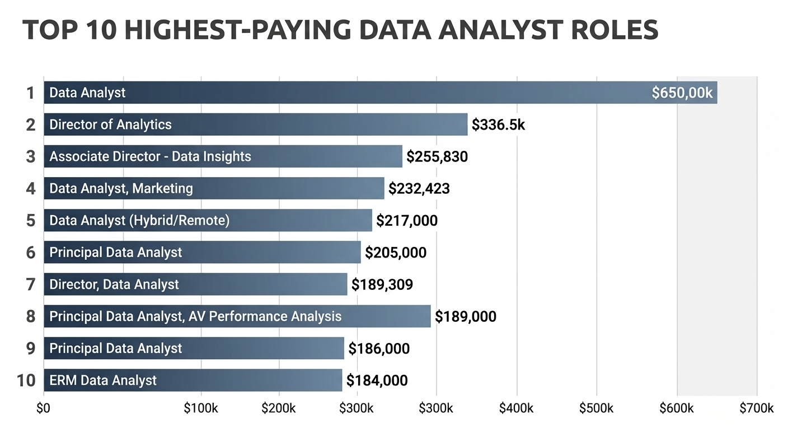
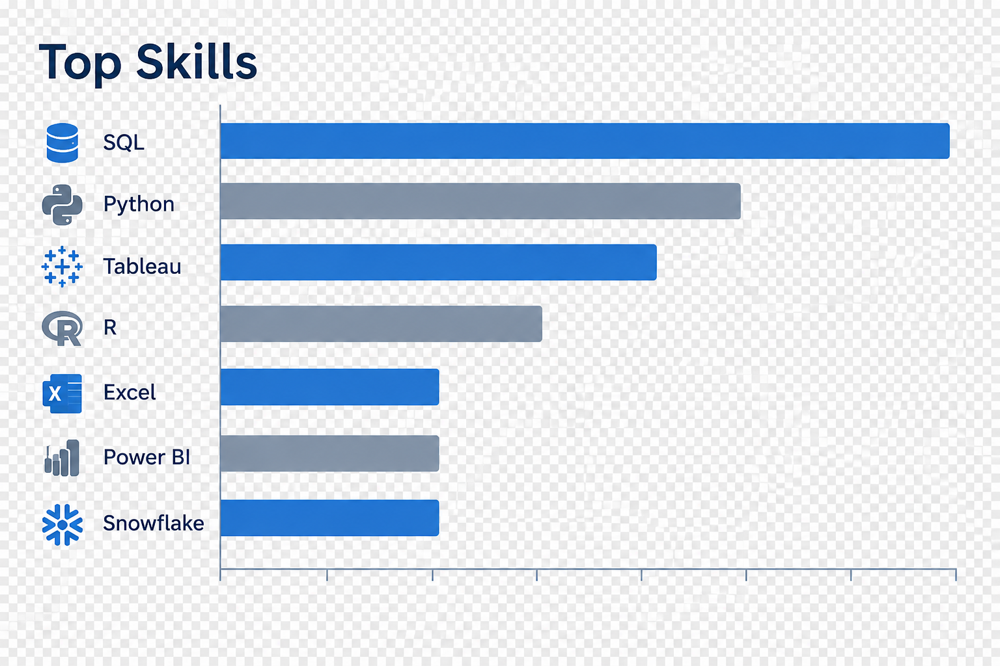
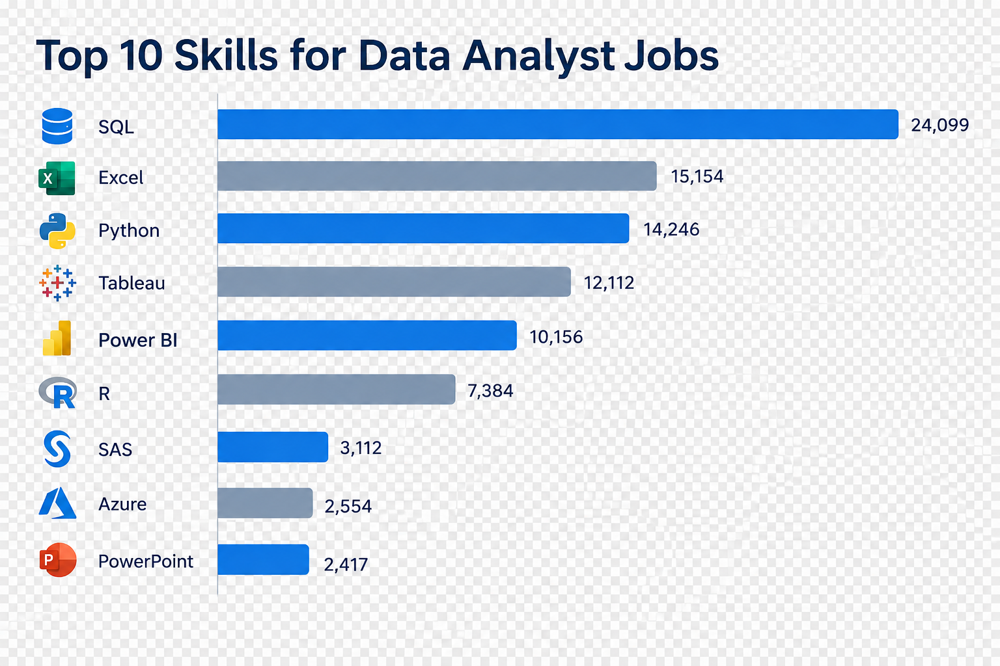

# Introduction
📊 Data Analyst Job Market & Skill Demands Analysis
Welcome to the Data Analyst Job Market Analysis repository! This project explores real-world tech job market data to identify top-paying skills, most in-demand technical tools, and optimal learning paths for aspiring Data Analysts, Business Analysts, and Data Scientists.

SQL Queries? Click them out here [sql_project](/my_project/)

# Background
Driven by a desire to navigate the evolving data landscape efficiently, this project was created to analyze the actual market dynamics surrounding Data Analyst roles. Rather than relying on general assumptions about what skills to learn, this repository uses data-driven queries to examine real-world job postings, salary distributions, and technical demand.

❓ Questions Answered
Through structured SQL queries, this project addresses key questions for aspiring data professionals:

What are the top-paying jobs for Data Analysts, and what salary levels do top-tier roles command?

Which technical skills (e.g., SQL, Python, Tableau, Cloud platforms) pay the highest salaries?

Which skills are most in demand by employers across the job market?

What are the optimal skills that strike a balance between high demand and top-tier compensation?
# Tools i used
- **Database Engine**: PostgreSQL

- **Tools Used**: Visual Studio Code, Git, GitHub, pgAdmin

- **Database Setup**: (create_database.sql, create_table.sql, load_table.sql): Structured relational schema linking job_postings_fact, skills_dim, and skills_job_dim.

- **SQL Techniques**: Multi-table JOINs, Aggregations (COUNT, AVG), Common Table Expressions (CTEs), and Ordering/Limiting.

# The analysis
To bridge the gap between learning tools and landing high-value opportunities, this analysis dives deep into job market data to decode which technical skills yield the highest compensation and demand
### 1-Top paying Data analyst roles
This query isolates the top 10 highest-paying Data Analyst roles by filtering for specified salary estimates and remote availability

```sql
SELECT
j.job_id,
j.job_title,
j.job_location,
j.job_schedule_type,
j.salary_year_avg,
j.job_posted_date,
c.name
FROM
job_postings_fact AS j
LEFT JOIN company_dim as c
ON j.company_id=c.company_id
WHERE
job_title_short='Data Analyst' AND
job_location='Anywhere' AND
salary_year_avg is not null
ORDER BY
salary_year_avg DESC
LIMIT 10
```


Here are the key insights derived from the top-paying data analyst roles analysis:

- *Executive Leadership Yields Maximum Premium: Beyond extreme compensation outliers, senior leadership positions like Director of Analytics ($336.5k) and Associate Director ($255.8k) represent the highest consistent earning potential in data analytics.*

- *Specialized Expertise Drives Higher Salaries: High-paying roles heavily reward specialized domain knowledge, as seen in targeted positions like Marketing Data Analyst ($232.4k) and AV Performance Analysis ($189k).*

- *High Compensation Floor for Senior ICs: Individual contributor roles at the Principal level maintain a strong, narrow salary range between $184,000 and $205,000 per year.*
### 2-Technical Skill Frequency in Top-Tier Analytics Positions
This analysis quantifies the most demanded skills across those top ten paying jobs
```sql
WITH top_paying_jobs AS(SELECT
j.job_id,
j.job_title,
j.job_location,
j.job_schedule_type,
j.salary_year_avg,
j.job_posted_date,
c.name
FROM
job_postings_fact AS j
LEFT JOIN company_dim as c
ON j.company_id=c.company_id
WHERE
job_title_short='Data Analyst' AND
job_location='Anywhere' AND
salary_year_avg is not null
ORDER BY
salary_year_avg DESC
LIMIT 10)
SELECT
top_paying_jobs.*,
skills_dim.skill_id,
skills_dim.skills
from
top_paying_jobs
INNER JOIN skills_job_dim ON top_paying_jobs.job_id=skills_job_dim.job_id
INNER JOIN skills_dim ON skills_job_dim.skill_id=skillS_dim.skill_id
```


**Main Insights**

- SQL is the Absolute Dominant Skill: SQL (Structured Query Language) is the most frequent or highly-rated skill in the data analysis dataset, indicated by its bar being nearly twice as long as most other entries.

- Programming Core (SQL + Python): SQL and Python form the critical foundation of the modern data analyst skillset, with both languages being significantly more common or prominent than any other tool.

- Tableau Leading Visualization: For data visualization-specific tools, Tableau holds a clear and substantial lead over its primary competitor, Power BI.

- Skill Consolidation at R and Below: Following the four "Tier 1" skills (SQL, Python, Tableau, R), there is a distinct drop-off, with R, Excel, Power BI, and Snowflake forming a secondary tier of important, but less foundational, skills.

### 3- In-demand skills for data analysts
This analysis identifies and quantifies the ten technical skills most frequently demanded in 'Data Analyst' job postings
```sql
SELECT
count(j.job_id)as skill_demand_count,
sk.skills,
s.skill_id
FROM
job_postings_fact AS j
INNER JOIN skills_job_dim as s ON j.job_id=s.job_id
INNER JOIN skills_dim as sk on s.skill_id=sk.skill_id

WHERE
job_title='Data Analyst'
group BY
sk.skills,
s.skill_id

ORDER BY
skill_demand_count DESC
limit 10;
```


Here are the 3 main key takeaways from the chart:
- **SQL is the Undisputed Foundation**: With 24,099 job postings, SQL leads by a massive margin—appearing in nearly 60% more job descriptions than the second-place tool. 
- **Core Triad (SQL, Excel, Python)**: Traditional tools like Excel (15,154) remain essential alongside Python (14,246), proving that baseline spreadsheet mastery and programming form the primary baseline for general job demand.
- **Visualization Dual Dominance**: Tableau (12,112) and Power BI (10,156) together account for over 22,000 mentions, showing that business intelligence and visual storytelling are nearly as vital as programming.  
# What i learned
Throughout this adventure, I've turbocharged my SQL toolkit with some serious firepower:

**🧩 Complex Query Crafting**: Mastered the art of advanced SQL, merging tables like a pro and wielding WITH clauses for ninja-level temp table maneuvers.
**📊 Data Aggregation**: Got cozy with GROUP BY and turned aggregate functions like COUNT() and AVG() into my data-summarizing sidekicks.
**💡 Analytical Wizardry**: Leveled up my real-world puzzle-solving skills, turning questions into actionable, insightful SQL queries.
# Conclusions
### Key Insights
From the analysis and hands-on project work, several core insights emerged regarding the data analyst market:

**Top-Paying Data Analyst Roles**: Remote data analyst opportunities present a wide compensation range, peaking at $650,000 for top-tier roles.

**Core Foundation (SQL & DBMS)**: High-paying roles consistently demand strong proficiency in SQL and a firm understanding of Database Management Systems (DBMS), proving that relational database fundamentals are essential for securing competitive roles.

**Most In-Demand Skills**: SQL remains the single most requested skill across job postings, making it a non-negotiable priority for job seekers.

**Niche Expertise & Premium Salaries**: Specialized or less common technologies (e.g., Solidity, SVN) yield higher average salaries, highlighting the financial payoff of niche technical capabilities.

**Optimal Skill Synergy**: Mastering SQL and core database concepts offers the highest intersection of market demand and salary growth, representing the most strategic investment for career advancement.
### Closing Thoughts
Building this project alongside Luke Barousse’s guided analysis provided a hands-on foundation in data analytics and real-world workflows. Beyond querying data with **SQL**, this project allowed me to work directly within **Visual Studio Code**, gain practical experience with **Database Management Systems (DBMS)**, and document the entire analytical pipeline using **GitHub**.

As an aspiring data analyst, this experience reinforced that technical success requires more than writing queries—it relies on using professional tools, understanding how databases operate behind the scenes, and maintaining clean code versioning. Moving forward, prioritizing high-demand skills like SQL while continually adopting industry-standard developer tools will remain central to my growth in data analytics.